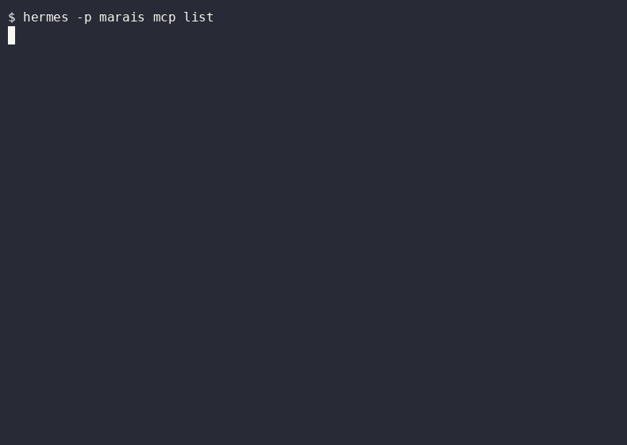
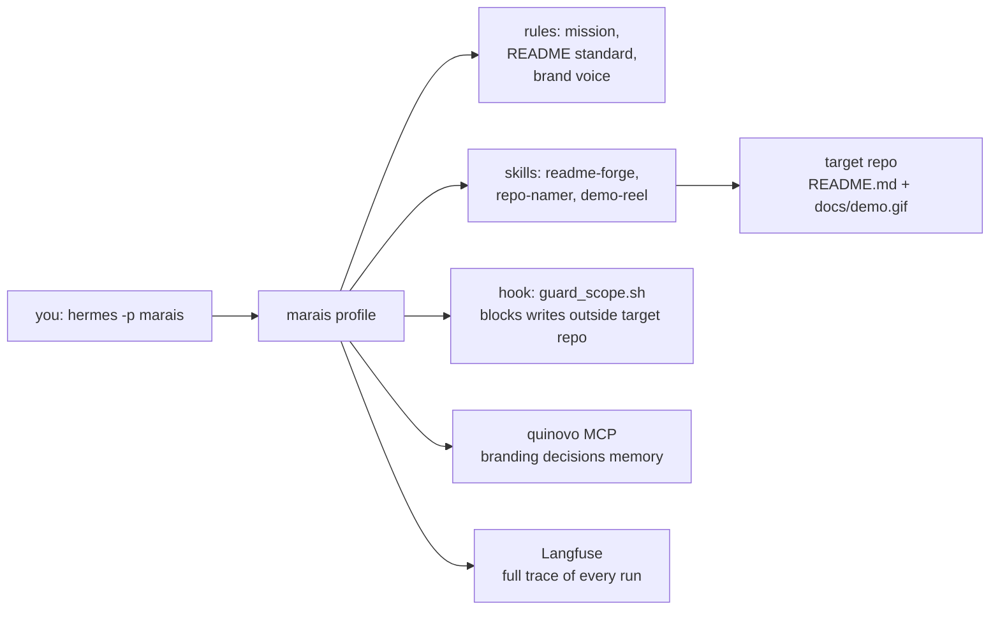

<p align="center">
  <h1 align="center">Marais</h1>
  <p align="center"><strong>A beautician for GitHub repos — a Hermes agent that polishes the storefront, the gallery, and the first impression.</strong></p>
  <p align="center">
    <a href="LICENSE"></a>
    <a href="https://github.com/NousResearch/hermes-agent"></a>
    <a href="https://langfuse.com"></a>
    <a href="https://mermaid.js.org"></a>
  </p>
</p>

<p align="center">
  
</p>

<p align="center"><em>Marais presenting itself — recorded live from the local instance with asciinema, rendered by agg.</em></p>

<p align="center">
  <a href="docs/demo.mp4"></a>
  <a href="docs/demo.gif"></a>
</p>

[**Watch the demo**](docs/demo.mp4) · [**Download the GIF**](docs/demo.gif)

## Why — the 30-second storefront

A recruiter decides whether a repo is worth opening in about 30 seconds. The window is a storefront: title, badge row, an embedded demo, a few concrete features, a copy-paste quickstart. Most repos fail not because the code is weak but because the storefront is — a bare paragraph, a dead screenshot, a feature list with no numbers. Marais is the beautician that rebuilds that storefront so the code behind it gets the read it earned.

## Features — what the atelier produces

- **READMEs that pass a quality gate** — hero with badges, embedded demo, mermaid architecture, quickstart, license footer. Refused until `tools/check_readme.py` exits 0.
- **Names and one-liners** — 5 scored name candidates with availability checks, 3 one-liner variants under 120 characters, GitHub topics.
- **Terminal demo videos** — a scripted recording of the repo's most impressive command, rendered to `docs/demo.gif` and `docs/demo.mp4` via asciinema or VHS.
- **Scoped to one repo per run** — a `guard_scope.sh` hook refuses to write outside the target directory, so the polish never spills onto the wrong project.
- **Traced end to end** — every run is recorded by Langfuse; the craft is inspectable, not opaque.

## Architecture

Marais is a Hermes Agent profile — an isolated agent home with its own rules, skills, hooks, and MCP wiring.



## Skills

| Skill | What it does |
|-------|--------------|
| `readme-forge` | Analyzes a repo, drafts a README to the Marais standard, scores it with `check_readme.py`, iterates until it passes |
| `repo-namer` | Proposes 5 scored name candidates + 3 one-liner variants, recommends one |
| `demo-reel` | Scripts and records a ≤60s terminal demo via asciinema or VHS, outputs `docs/demo.gif` + `docs/demo.mp4` |

## Quickstart

Requires [Hermes Agent](https://github.com/NousResearch/hermes-agent) v0.20+ and git. Asciinema or VHS is optional (only needed for demo recording).

```bash
git clone https://github.com/cfollette18/marais.git
cd marais
./install.sh
```

Then polish any repo:

```bash
cd /path/to/target-repo
hermes -p marais chat -q "Give this repo a recruiter-ready README" -Q
```

Use `chat -q ... -Q`, never `-z`: one-shot mode bypasses Hermes' plugin manager, so Langfuse tracing only fires in chat runs.

`install.sh` is idempotent — it creates the `marais` profile, links the rules and skills, installs the config, symlinks the shared `.env`, verifies the Langfuse dependency, and prints the exact follow-up commands.

## Configuration

Configured by `config.yaml`:

| Key | Value | Purpose |
|-----|-------|---------|
| `model.default` | `MiniMax-M3` | Generation model |
| `toolsets` | `file, terminal, web, skills, todo` | Only what presentation needs |
| `agent.max_turns` | `60` | Run budget per session |
| `hooks.pre_tool_call` | `guard_scope.sh` | Confines writes to the target repo |
| `mcp_servers.quinovo` | local Quinovo pack | Remembers branding decisions per repo |
| `plugins.enabled` | `observability/langfuse, quinovo` | Tracing + memory |

## Example output

A real before/after proof run lives in [`examples/mcp-epicor/`](examples/mcp-epicor/) — Marais turned a working but un-presented MCP server into a repo with an embedded demo, a scored README, and a one-liner. The harness ships empty; the first run populates the gallery.

## License

MIT. Written by Clinton Follette.