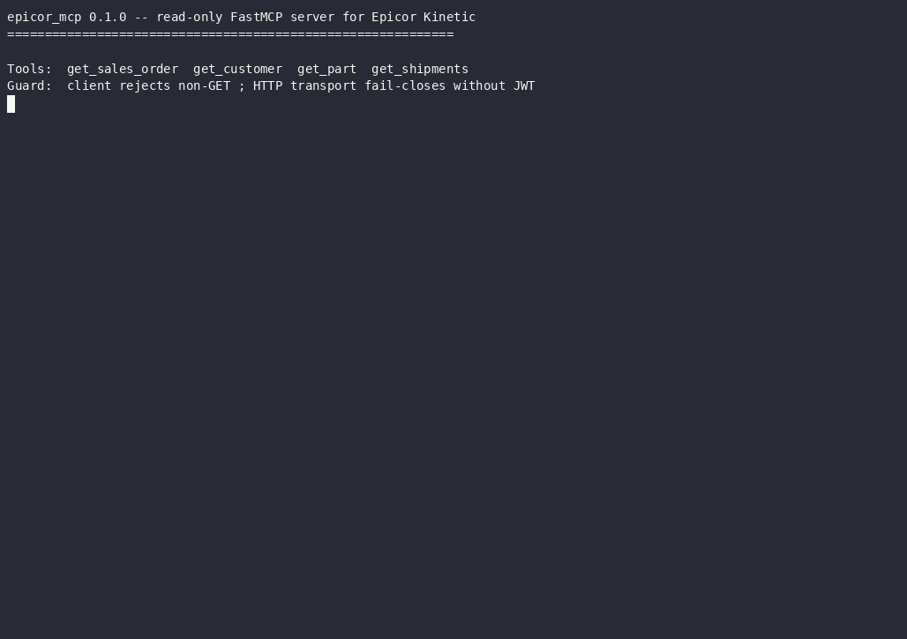
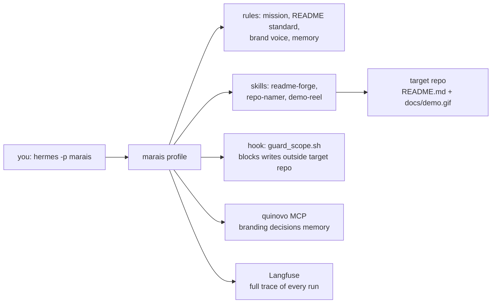

<p align="center">
  <h1 align="center">Marais</h1>
  <p align="center">The repo presentation atelier — a Hermes agent that gives every repository a recruiter-ready face.</p>
  <p align="center">
    <a href="LICENSE"></a>
    <a href="https://github.com/NousResearch/hermes-agent"></a>
    <a href="https://langfuse.com"></a>
  </p>
</p>



*Proof-run output — Marais presenting [mcp-epicor](https://github.com/cfollette18/mcp-epicor); recorded with asciinema, rendered by agg.* [Watch the full demo](examples/mcp-epicor/docs/demo.mp4)

## Why

A recruiter spends about 30 seconds on a repository. In that window the README is the interview: it either shows a working demo, a clear feature list, and a copy-paste quickstart — or it gets closed. Most repos fail the 30-second test not because the code is weak but because the presentation is. Marais fixes the presentation.

## Features — what it generates

- **READMEs that pass a quality gate** — hero section with badges, embedded demo, mermaid architecture diagram, quickstart, and a scoring script (`tools/check_readme.py`) that refuses to pass until every required section is present.
- **Names and one-liners** — 5 scored name candidates with availability checks, 3 one-liner variants under 120 characters, GitHub topics.
- **Terminal demo videos** — a scripted recording of the repo's most impressive command, rendered to `docs/demo.gif` and `docs/demo.mp4` via VHS or asciinema.

## Architecture

Marais is a Hermes Agent profile — a complete, isolated agent home with its own rules, skills, hooks, and MCP wiring.



## Quickstart

Requires [Hermes Agent](https://github.com/NousResearch/hermes-agent) v0.20+ and git. VHS or asciinema is optional (demo recording only).

```bash
git clone https://github.com/cfollette18/marais.git
cd marais
./install.sh
```

Then present any repo:

```bash
cd /path/to/target-repo
hermes -p marais chat -q "Give this repo a recruiter-ready README" -Q
```

Use `chat -q`, not `-z`: one-shot mode skips Hermes' plugin manager, so Langfuse tracing only fires in chat runs.

`install.sh` is idempotent: it creates the `marais` profile, links the rules and skills, installs the config, symlinks the shared `.env`, verifies the Langfuse dependency, and prints the exact follow-up commands.

## Skills

| Skill | What it does |
|-------|--------------|
| `readme-forge` | Analyzes a repo, drafts a README to the Marais standard, scores it with `check_readme.py`, iterates until it passes |
| `repo-namer` | Proposes 5 scored name candidates + 3 one-liner variants, recommends one |
| `demo-reel` | Scripts and records a ≤60s terminal demo via VHS or asciinema, outputs `docs/demo.gif` + `docs/demo.mp4` |

## Configuration

The profile is configured by `config.yaml`:

| Key | Value | Purpose |
|-----|-------|---------|
| `model.default` | `MiniMax-M3` | Generation model |
| `toolsets` | `file, terminal, web, skills, todo` | Only what repo presentation needs |
| `agent.max_turns` | `60` | Run budget per session |
| `hooks.pre_tool_call` | `guard_scope.sh` | Confines writes to the target repo |
| `mcp_servers.quinovo` | local Quinovo pack | Remembers branding decisions per repo |
| `plugins.enabled` | `observability/langfuse, quinovo` | Tracing + memory |

## Example output

Proof-run artifacts — a real before/after generated by this harness — live in [`examples/`](examples/). The harness ships empty; the first proof run populates it.

## License

MIT. Written by Clinton Follette.
