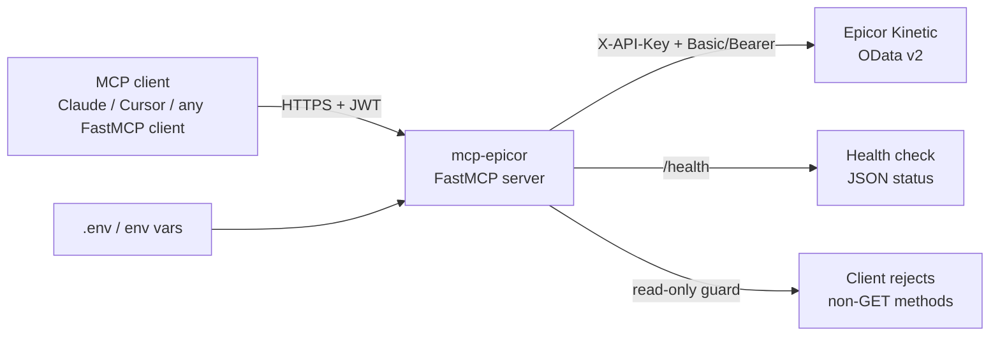

<div align="center">

# mcp-epicor

Exposes four read-only Epicor Kinetic OData queries as MCP tools, with HTTP transport that fails closed without a verified JWT.

[](LICENSE)
[](pyproject.toml)
[](https://gofastmcp.com)
[](pyproject.toml)

</div>


[Watch the full demo](docs/demo.mp4)

## Features

- **Four tools, all read-only.** `get_sales_order`, `get_customer`, `get_part`, `get_shipments`. No POST, PATCH, or DELETE — the HTTP client refuses any method outside `GET`.
- **Fail-closed HTTP transport.** The server refuses to boot on `MCP_TRANSPORT=http` unless `MCP_JWKS_URI` (production) or `MCP_JWT_SECRET` (internal HMAC) is set. STDIO is unaffected.
- **Configuration over prompt.** The Kinetic Company id lives in `EPICOR_COMPANY`, never as a tool argument, so an agent cannot cross tenants by accident.
- **`$select` and `$expand` are always applied server-side.** The wire payload is bounded — no accidental `OrderDtls` avalanche.
- **Pluggable outbound auth.** `X-API-Key` header, Basic (username + password), or Bearer — pick one in `.env`.
- **4 passing tests** (`pytest tests/`) exercise the read-only guard, the inbound-auth fail-closed path, and a full tool round-trip against a mocked Kinetic client.

## Architecture



Inbound auth is verified by `JWTVerifier` before any tool call. Outbound
calls are made by `httpx.AsyncClient` against
`/api/v2/odata/{EPICOR_COMPANY}/Erp.BO.{Svc}/{Entity}`. The read-only
guard is enforced inside `_request`, not at the tool layer, so it cannot
be bypassed by a future tool.

## Quickstart

Local install with `uv` or `pip`, then point an MCP client at the
`mcp-epicor` command:

```bash
git clone https://github.com/cfollette18/mcp-epicor
cd mcp-epicor
python -m venv .venv && source .venv/bin/activate
pip install -e ".[dev]"
cp .env.example .env       # fill in your Kinetic credentials
pytest                     # 4 passed
```

Add the server to your MCP client config (Claude Desktop, Cursor, etc.):

```json
{
  "mcpServers": {
    "epicor": {
      "command": "mcp-epicor",
      "env": {
        "EPICOR_BASE_URL": "https://your-server/kinetic",
        "EPICOR_COMPANY": "YOURCO",
        "EPICOR_API_KEY": "<key>",
        "EPICOR_USERNAME": "<user>",
        "EPICOR_PASSWORD": "<password>"
      }
    }
  }
}
```

The default transport is `stdio`. The server exposes no write tools and
will not start an HTTP listener until you opt in.

## Usage

### 1. Look up a sales order by `OrderNum`

```text
> get_sales_order(order_num=10452)
{
  "order_num": 10452,
  "customer_cust_id": "ANDERS",
  "lines": [
    {
      "order_line": 1,
      "part_num": "WID-1",
      "selling_quantity": 10,
      "releases": [
        {
          "order_rel_num": 1,
          "our_req_qty": 10,
          "our_stock_shipped_qty": 6,
          "our_job_shipped_qty": 0
        }
      ]
    }
  ]
}
```

Short-ship = `OurReqQty − (OurStockShippedQty + OurJobShippedQty)`. For
shipped pack lines, follow up with `get_shipments(order_num=10452)`.

### 2. Look up a customer by `CustID`

```text
> get_customer(cust_id="ANDERS")
```

Either `cust_num` or `cust_id` is required, never both. The client escapes
single quotes inside the `CustID` filter so a customer named `O'Brien`
cannot smuggle OData.

### 3. Run the server over HTTP behind a JWT verifier

```bash
export MCP_TRANSPORT=http
export MCP_HOST=127.0.0.1
export MCP_PORT=8002
export MCP_JWKS_URI=https://login.example.com/.well-known/jwks.json
export MCP_JWT_ISSUER=https://login.example.com
export MCP_JWT_AUDIENCE=mcp-epicor
mcp-epicor
```

Without `MCP_JWKS_URI` and without `MCP_JWT_SECRET` set, the process exits
with `RuntimeError: HTTP transport is fail-closed.` — the same fail-closed
path the test suite asserts on. Endpoint: `http://127.0.0.1:8002/mcp`.
Health: `curl http://127.0.0.1:8002/health`.

## Configuration

| Variable             | Required        | Purpose                                                  |
|----------------------|-----------------|----------------------------------------------------------|
| `EPICOR_BASE_URL`    | yes             | Kinetic origin, no trailing slash                        |
| `EPICOR_COMPANY`     | yes             | Path segment in `/api/v2/odata/{Company}/...`            |
| `EPICOR_API_KEY`     | typical         | Sent as `X-API-Key`                                      |
| `EPICOR_USERNAME`    | with password   | Basic auth pair                                         |
| `EPICOR_PASSWORD`    | with username   | Basic auth pair                                         |
| `EPICOR_BEARER_TOKEN`| optional        | Alternative to Basic                                     |
| `EPICOR_TLS_VERIFY`  | optional (bool) | Default `true`; set `false` only for trusted test hosts |
| `MCP_TRANSPORT`      | optional        | `stdio` (default) or `http`                             |
| `MCP_HOST`           | optional        | Default `127.0.0.1`                                      |
| `MCP_PORT`           | optional        | Default `8002`                                          |
| `MCP_JWKS_URI`       | HTTP required   | Production inbound JWT verification                      |
| `MCP_JWT_SECRET`     | HTTP internal   | HMAC JWT for local/ephemeral use                         |
| `MCP_JWT_ISSUER`     | optional        | Default `mcp-epicor`                                    |
| `MCP_JWT_AUDIENCE`   | optional        | Default `mcp-epicor`                                    |
| `MCP_ALLOWED_HOSTS`  | optional        | Comma-separated host allow-list for HTTP                |

Secrets belong in environment variables or a secret store. The `.env`
file is gitignored.

## License

MIT. Copyright (c) 2026 Clinton Follette.
